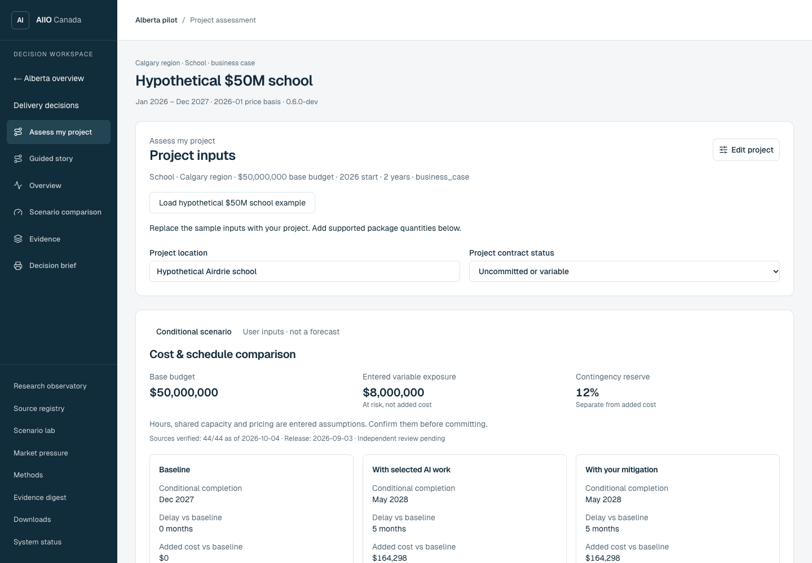
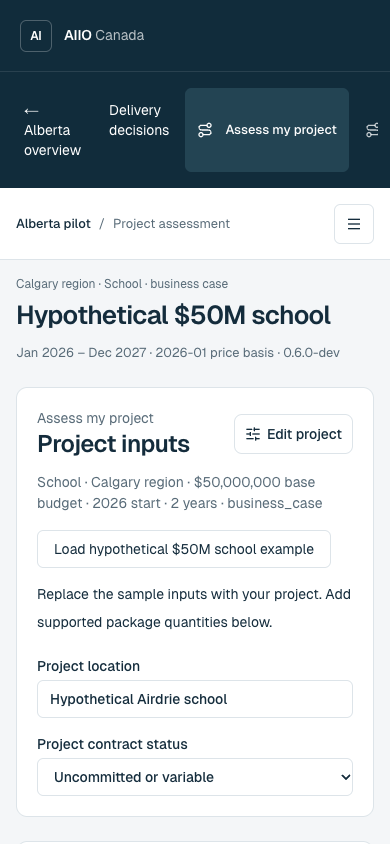

# AI Infrastructure Impact Observatory Canada

Explore how AI infrastructure investment could compete with Canadian public projects for labour, materials and power. AIIO Canada connects public evidence, transparent assumptions and interactive scenarios; Alberta is the first implementation.

**[Try the live demo](https://aiio-canada.vercel.app/) · [Assess a project](https://aiio-canada.vercel.app/project-scenario?view=assessment) · [Explore the Alberta pilot](https://aiio-canada.vercel.app/construction/pilot)**

The live demo is maintained separately from this public source snapshot and may evolve independently.

## Try it in two minutes

1. Open the [owner assessment](https://aiio-canada.vercel.app/project-scenario?view=assessment).
2. Select **Load hypothetical $50M school example**. This supplies a school project with a CAD $50 million budget and CAD $8 million of remaining electrical package exposure, plus explicit example assumptions.
3. Inspect the **conditional** result, package inputs and evidence status. The loaded assumptions support a calculation; they do not establish a measured AI effect on a real school.
4. Open **1. Packages**, then **Electrical package**. Change **Electrical commitment** to fixed. Price escalation for that package becomes zero, while assumed resource-related delay can remain. Contract price protection and delivery capacity answer different questions.
5. Use **Export current assessment JSON** to inspect the inputs alongside the result. Start from your own evidence before applying any example to a real project.

See the [walkthrough](docs/project-assessment-walkthrough.md) for interpretation and screenshot details.

### Desktop



### Mobile



## What you can explore

- **Project assessment:** compare package exposure, commitment and shared-resource assumptions; export an inspectable assessment record.
- **Alberta pilot:** explore a hypothetical CAD $50 billion investment scenario over 2027–2036, with construction and power evidence.
- **Research evidence:** inspect source provenance, observed data, model contracts and readiness gates rather than treating every output as an established finding.

## Run locally

Use Node.js **22.13 or newer**, npm and Python **3.12 or newer**. No deployment credentials or source downloads are needed for the initial app walkthrough.

```bash
git clone https://github.com/chiKeka/aiio-canada-public.git
cd aiio-canada-public
npm ci
npm run dev
```

Open <http://localhost:3000/project-scenario?view=assessment>. If Next.js selects another port, use the URL printed in the terminal.

For a production build:

```bash
npm run build
npm run start
```

See [CONTRIBUTING.md](CONTRIBUTING.md) for checks, repository orientation and starter work. Native Next.js commands are the canonical local path; optional Sites-compatible commands are listed in `package.json`.

## Research boundaries

Every published value must be marked **observed**, **corroborated**, **inferred**, **assumed**, or **scenario-only**. Scenario outputs are **not forecasts**. The v0.2 pressure scores are uncalibrated structural diagnostics, not empirical findings, probabilities, percentages or measured project delays. Conditional project outputs depend on entered assumptions and evidence; changing an input does not establish causation.

Program completeness and publication readiness are separate. Independent review and decision-grade validation remain explicit gates. Read the [program readiness audit](docs/release/program-readiness-audit.md), [calibration protocol](docs/methodology/calibration-protocol.md) and [attribution identification method](docs/methodology/ai-attribution-identification.md).

## Public source boundary and licence

This repository starts from a reviewed public snapshot with fresh Git history. Some original source archives are deliberately withheld for redistribution rights or privacy reasons. Retained observations and scenarios are not newly validated by that transformation. Historical release receipts do not describe this transformed snapshot.

Read [PUBLIC_SNAPSHOT.md](PUBLIC_SNAPSHOT.md), [THIRD_PARTY_DATA.md](THIRD_PARTY_DATA.md) and the [source licence matrix](publication/source-license-matrix.json) before acquiring or redistributing source material. Source-dependent commands are gated; the complete original analytical suite requires unavailable archives.

Original software and documentation use [Apache License 2.0](LICENSE). Third-party data and vendored software retain their own terms and notices.
